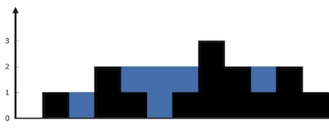

# Trapping Rain Water

## Problem Statement
Given `n` non-negative integers representing an elevation map where the width of each bar is 1, compute how much water it can trap after raining.

## Constraints
- The length of the input array `height` is greater than 0.
- Each element in `height` is a non-negative integer.

## Example

**Input**: `height = [0,1,0,2,1,0,1,3,2,1,2,1]`  
**Output**: `6`  
**Explanation**: The trapped water is 6 units.

## Approach
### Approach

The solution for the "Trapping Rain Water" problem employs the **two-pointer technique**, which optimizes space and time complexity. 

1. **Initialization**: Two pointers, `l` (left) and `r` (right), are set at the beginning and end of the elevation array, respectively. Variables `lmax` and `rmax` track the maximum heights encountered from both sides.

2. **Iterative Comparison**: The algorithm iterates until the two pointers meet. At each step:
   - Compare the heights at the two pointers.
   - If the height at the left pointer is smaller, check if `lmax` is greater than the current height. If so, water can be trapped, and the trapped amount is added to the total. If not, update `lmax`.
   - Conversely, if the right height is smaller or equal, perform similar checks for `rmax`.

3. **Calculation**: This approach effectively calculates the trapped water by leveraging the heights encountered as the pointers converge, ensuring a linear scan through the elevation map.

4. **Result**: The total trapped water is returned at the end of the loop, yielding an efficient O(n) time complexity while maintaining O(1) space complexity.

This method is both intuitive and efficient, making it a popular solution for such problem.

### Time Complexity
- O(n), where n is the number of elements in the height array.

### Space Complexity
- O(1), as we are using constant space for variables.
