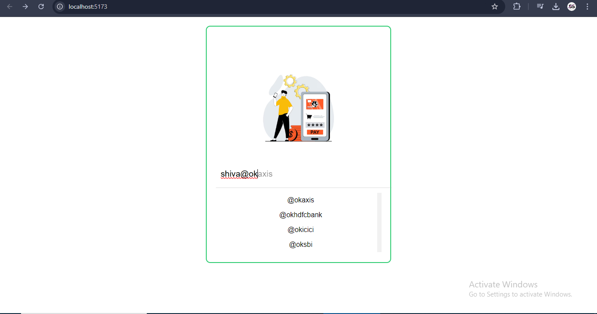

# React Autocomplete feature

### Demo



##### This Software is used to autocomplete the list of UPI Id data. This Project is kinda Microfrontend Project. Where User has to put their upi id and according to the bank_name it shows Suggestions to autocomplete the remaining sentence.

##### Well UPI consists three things:

```js
    VPA = Virtual Private Address
    AT_SIGN = `@`
    BANK_SIGNATURE = `Every bank signature is different. i.e Okaxis,Okhdfc like that.`

```

##### This Project Built Using following Technologies:

- `REACT`
- `NODEJS`
- `VITE`

# Project Setup

1. clone the project ` git clone https://github.com/Groot-2001/Frontend_Interview_Questions.git`
2. change directory to autocomplete `cd autocomplete `
3. install All the dependencies `npm install `
4. run the file using `npm run dev`

# Problems Faced During the Project Development:

## UI Problem

- How to stack two input element into one another?
- How to render Suggestion list in UI?

## Development Problem

- How to split UPI string into vpa@bankname?
- validating VPA and BankName
- Handling multiple edge cases:
  - case 1: if there is no `@` sign suggestionlist should not listdown.
  - case 2: if there is no users_vpa suggestionlist should not listdown.
  - case 3: if there is no bank name found return empty string.

### Built With Love 💖 and Passion ⚡.
