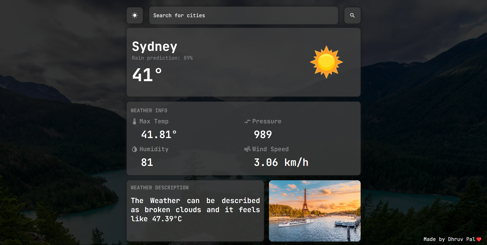
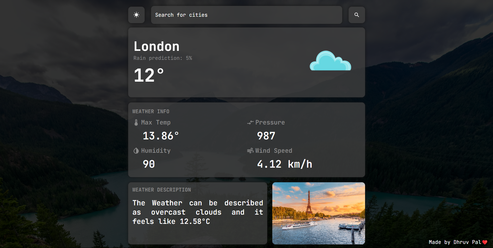

# React Weather App🌥️

This is a functional weather app made using react and vite. I have used the OpenWeatherMap API to get the weather data.
preview - [WeatherApp](https://dpweatherappreact.netlify.app/)
## Screenshots

  

````
## Features

<ul>
<li>Rain Prediction</li><br>
<li>Colorful weather icons</li><br>
<li>Max Temperature</li><br>
<li>Humidity</li><br>
<li>Pressure</li><br>
<li>Wind Speed</li><br>
<li>Precise weather description</li><br>
</ul>

## Dependencies Used

<ul>
<li style="color:red;">Styled Components</li>
<li style="color:yellow;">Material Icons</li>
</ul>

## How to run

1. <span style="color:green;">npm i</span> or <span style="color:green;">npm install</span> -> to install all the required dependencies<br>
2. <span style="color:green;">npm run dev</span> -> to run the server <br>
3. Click on the localhost with port mentioned after running the server

## Developer

[dhruv1086k](https://www.linkedin.com/in/dhruv1086k/)
